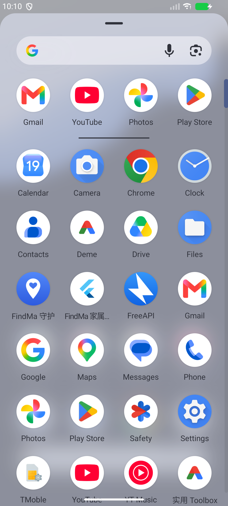
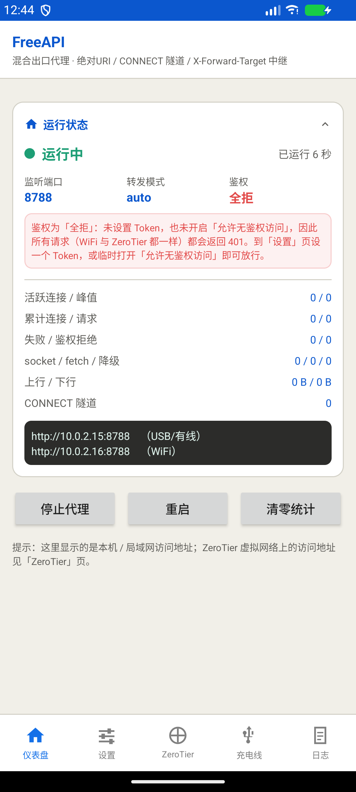
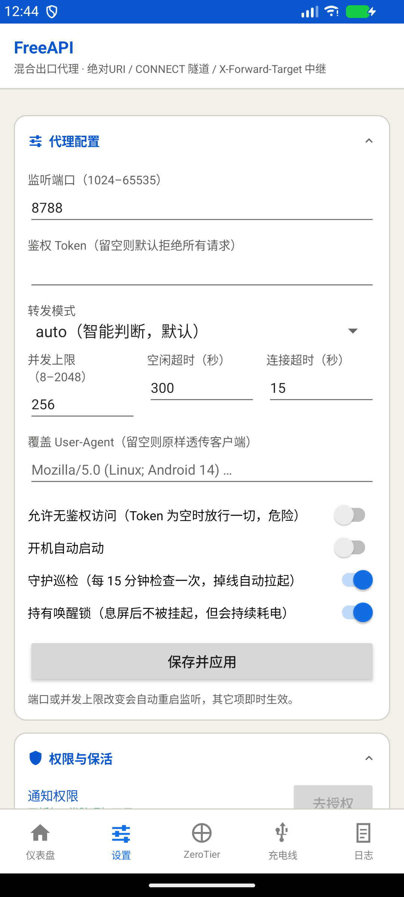
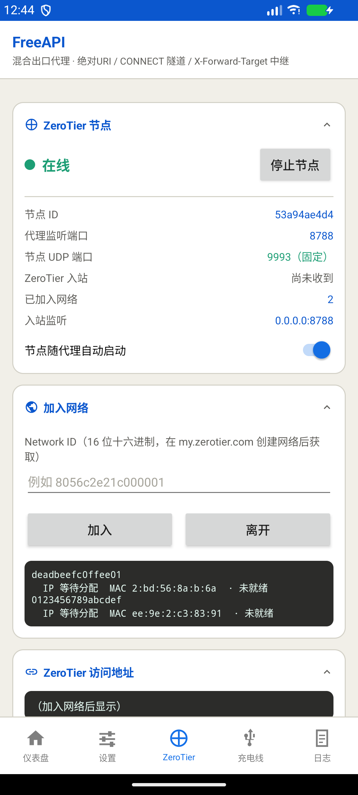
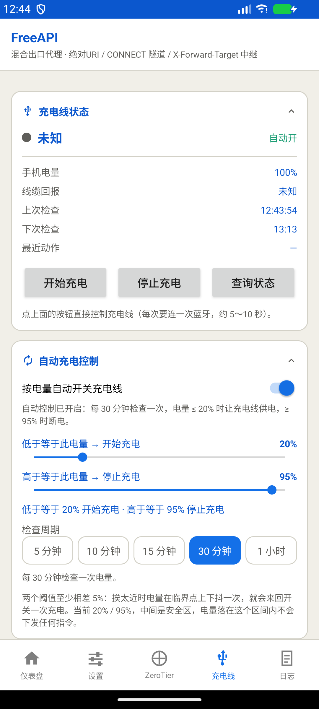
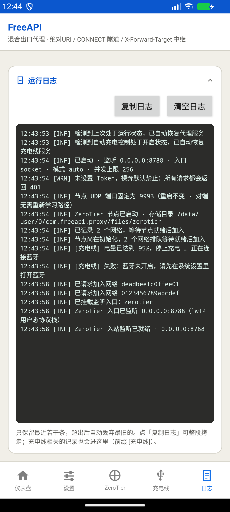
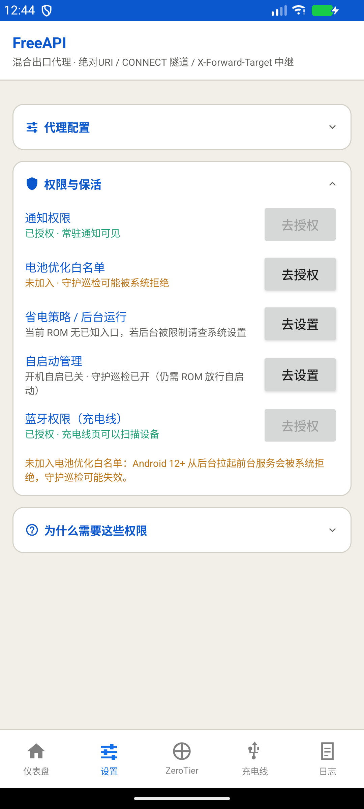

# FreeAPI · Android 端

把 `node/node-server.js` 那套混合出口代理整体搬进 Android 前台服务 —— 手机自己就是一台常驻的出口代理。

```
应用名    FreeAPI
包名      com.freeapi.proxy
图标      蓝色渐变底 + 白色闪电（源自 /Users/iceet/Work/FreeAPI/menubar/out/FreeAPI.icns）
产物      app/build/outputs/apk/debug/app-debug.apk（≈3.7 MB）
工具链    AGP 8.2.2 · Kotlin 1.9.22 · Gradle 8.4 · compileSdk 34 · minSdk 26 · targetSdk 34
依赖      仅 OkHttp 4.12（fetch 兜底路径）
```

---

## 构建与安装

```bash
cd android
bash build.sh          # 或者 ./build.sh / sh build.sh，三者等价
```

> **关于启动方式**：脚本用了数组、进程替换 `< <(...)`、here-string `<<<` 等 bash 专有语法，
> POSIX sh 解析不了。因此文件头部内置了一段**自举守卫**：只要解释器跑不了这些语法，
> 就自动用 bash 重新执行自己。所以 `bash` / `./` / `sh` / `zsh` 四种敲法都能正常工作。
>
> 守卫的判据是「`BASH_VERSION` 为空 **或** 当前 bash 开着 `posix` 选项」——第二条不能省，
> 因为 macOS 的 `/bin/sh` 本身就是 bash 3.2，它**依然会设置 `BASH_VERSION`**，
> 只判第一条会让 `sh build.sh` 漏网，直接抛 `syntax error near unexpected token '<'`。

`build.sh` 是交互式菜单（自动探测 SDK / JDK / 设备），提供：

| 菜单项 | 说明 |
|---|---|
| 构建并安装到设备 | `assembleDebug` + `adb install -r` + 可选拉起 App，并打印 curl 验证命令 |
| 仅构建 Debug APK | |
| 安装已构建的 APK | 含 `curl -x` / `X-Forward-Target` 两种验证示例 |
| 实时查看 App 日志 | logcat 过滤 |
| 前台服务 / 存活状态自检 | 一次性 dump 进程、FGS 类型、唤醒锁、电池白名单、守护闹钟 |
| 清理构建产物 | |

非交互方式：

```bash
export JAVA_HOME=$(/usr/libexec/java_home -v 17)
export ANDROID_HOME=~/Library/Android/sdk
./gradlew assembleDebug
```

---

## 应用图标


应用抽屉里的实际效果（Pixel Launcher，圆形蒙版）：



图标由 `FreeAPI.icns` 转换而来，**不是简单地贴一张位图** —— 分成自适应图层重建：

| 层 | 内容 | 来源 |
|---|---|---|
| `ic_launcher_background` | 垂直渐变 `#3DA3FF → #0756DD` | 从源图 1024 画布采样反解 |
| `ic_launcher_foreground` | 白色闪电，7 顶点矢量路径 | 源图轮廓跟踪 + RDP 多边形简化 |
| `ic_stat_proxy` | 通知栏小图标（同一闪电，24dp 版） | 同一套顶点等比缩放 |

两个关键换算：

1. **端点色要外推**：源图渐变铺满 1024 画布，而 adaptive icon 只有中心 72×72 会被蒙版裁出可见，渐变被截取中间 2/3 后对比会变弱。因此端点色从源图的 `#3496FB → #1063E3` 外推为 `#3DA3FF → #0756DD`，使**可见区内**渲染出的颜色正好回到源图值。
2. **闪电要缩进安全区**：闪电取高 68（占 72 可见区的 94.4%，与源图 96% 的视觉比例基本一致），所有顶点到画布中心的最大半径 36.07 —— 圆形蒙版（半径 36）下不会被切开尖端。

另外带 `<monochrome>` 图层，支持 Android 13+ 主题图标；`mipmap-{mdpi..xxxhdpi}/` 下有 legacy PNG 兜底（虽然 `minSdk 26` 走不到）。

重新生成图标资源所用的分析脚本思路见 `docs/`（轮廓跟踪 → RDP 简化 → 安全区映射 → 反解渐变端点）。

---

## 界面

底部 5 个 Tab（微信式底部导航），图标为自绘矢量图，选中态品牌蓝、未选中灰。**ZeroTier 排在正中间**（第 3 个）—— 左边是「仪表盘 / 设置」（把代理跑起来并配好），右边是「充电线 / 日志」（辅助与排查），最常用的对外入口居中。



1. **仪表盘** — 运行/停止状态、运行时长、端口、模式、鉴权方式、活跃连接/峰值、累计连接/请求、失败/鉴权拒绝、socket/fetch/降级次数、上/下行字节、CONNECT 隧道数；底部是可直接复制的 `http://<局域网IP>:<端口>`。同页带「启动/停止、重启、清零统计」三个主控按钮——把状态与控制放同一页是有意的，这是最高频路径，不该埋进二级页面。
2. **设置** — **原「配置」与「权限」两页合并而来**（理由见下）。上半张卡是代理参数：端口、Token、模式（auto/socket/fetch）、并发上限、空闲超时、连接超时、UA 覆盖、允许无鉴权、开机自启、守护巡检、持有唤醒锁；「保存并应用」后**端口或并发上限变化会自动重启监听**，其余即时生效。下半张卡是保活与权限：通知、电池优化白名单、省电策略、自启动、蓝牙，每项带**如实**的状态与一键跳转，缺哪项就用黄字点出来。

   

3. **ZeroTier** — 启动 App 内置的 ZeroTier 节点（libzt，不需要装官方客户端）、加入虚拟网络、显示可被同网络其它设备访问的地址，并如实反映入站监听是否挂上。方案与踩坑记录见 [ZeroTier 入站](#zerotier-入站libzt-内置节点) 与 [`docs/zerotier-integration-plan.md`](docs/zerotier-integration-plan.md)。

   

4. **充电线** — 通过蓝牙控制外部充电开关（按电量自动通断 + 每日充电时段 / 手动控制），详见 [充电线控制](#充电线控制蓝牙)。功能移植自同目录外的 `autoLine` 工程，"每日充电时段"是在其之上新加的一层。

   

5. **日志** — 最近 240 条环形缓冲，可复制/清空；充电线的记录也会带 `[充电线]` 前缀进这里。

   

### 卡片：统一头部 + 可折叠

所有页面的卡片都换成 `ui/widget/CardLayout`：**图标 + 标题 + 折叠箭头由代码生成**，布局里只声明属性、不写标题行：

```xml
<com.freeapi.proxy.ui.widget.CardLayout
    style="@style/Card"
    app:cardIcon="@drawable/ic_tab_dashboard"
    app:cardTitle="@string/sec_status">
    <!-- 下面都是卡片内容 -->
</com.freeapi.proxy.ui.widget.CardLayout>
```

- 点标题栏（整条都是点击区，不是只点那个 15dp 的小箭头）即可折叠，箭头随之翻转。
- **折叠/展开无动画**（2026-09-20 按需求去掉）：原先是 `TransitionManager.beginDelayedTransition(AutoTransition)` 做高度/透明度过渡 + `chevron.animate().rotation()` 转箭头，现在两处都已移除，可见性直接切换。原因是一屏内卡片密集，多条过渡同时跑会让整屏「晃」一下，观感反而更卡。**要加回来就两处一起加**，只转箭头会显得突兀。
- 折叠状态按 `cardKey`（默认取标题）持久化在 `shared_prefs/freeapi_ui.xml`，**只记"已折叠"**，默认展开 —— 这样新加的卡片永远不会因为键名对不上而莫名藏起来。
- `app:cardFillBody="true"` 给需要 `weight` 撑满整屏的卡片（日志页）用。这类卡片折叠时会把**自身的 weight 一并收掉**，否则会留下一张只有标题、下面一片空白的大白卡。

> ⚠️ 两个必须知道的坑，改 `CardLayout` 前先读：
> 1. **`onFinishInflate()` 里拿不到 `layoutParams`。** LayoutInflater 的顺序是 `createViewFromTag → generateLayoutParams → rInflateChildren（触发 onFinishInflate）→ addView`，`addView` 才真正设置它。早读一步会拿到 `null`，于是「折叠后收起来」**静默失效**（现象就是上面那张大白卡）。所以原始占位参数在 `onAttachedToWindow()` 里补记。
> 2. **内容容器由 `CardLayout` 接管 `layoutParams`**，所以卡片内部不能用依赖"直接父容器"的属性（如 `layout_weight`）—— 需要铺满时走 `cardFillBody`。

 · [折叠](docs/ui-11-card-collapsed.png) / [展开](docs/ui-12-card-expanded.png) 对照

### 为什么把「配置」和「权限」合并成「设置」

两者都是"把事情配好"的一次性动作，而且强相关 —— **代理能不能持久，前提就是权限那几项都放行了**（省电策略 / 白名单 / 自启动）。分成两页时，用户排查"后台为什么被杀"要来回对照两页，容易漏。合并后一屏之内能同时看到"我配了什么"和"系统放行了什么"。

顺带解决了一个状态诚实问题：页面上的「自启动管理」那一行原先读的是**已存盘的配置**，用户刚拨完开关还没点保存时会显示旧值。现在改为读**开关本身**，并在两侧不一致时补一句「（有改动未保存）」。

### 为什么 Tab 条是自绘的

**没有引入 Material 库**。当前主题是 `Theme.AppCompat.DayNight.NoActionBar`，而 Material 的 `TabLayout` 等组件要求 `Theme.MaterialComponents.*` 父主题；换主题会连带改变现有**所有** `Button` / `Switch` 的观感（`<Button>` 会被自动替换成 MaterialButton）。

所以 Tab 条用 `LinearLayout + ImageView + TextView` 在代码里生成：**零新增依赖、零主题风险**，APK 体积不受影响。5 个页签也不需要滑动切换手势。

页面用 `add + show/hide` 管理而不是 `replace`：全部一次性 add，切换只改可见性——来回切页不会重建视图，因此不丢滚动位置、不丢输入内容。

### 刷新策略

`MainActivity` 每秒只刷新**当前可见**的那一页（通过 `ui/Tile` 接口）。**设置页实现了 `Tile` 但只刷新权限那半张卡** —— 上半张全是输入框，若每秒重绑一次，用户正敲端口号时输入会被覆盖。日志页则用「版本号比对」而非文本比对，避免长日志下每秒做一次无谓的字符串比较；充电线页同理，并且为滑块/开关准备了 `syncingSeek` / `syncingSwitch` 抑制标志，防止"每秒刷新"被误判成"用户操作"而反过来触发一次蓝牙连接。


---

## 协议契约（与 `node/node-server.js` 逐条对齐）

| 能力 | node 实现 | Android 落法 |
|---|---|---|
| 入站：HTTP 绝对 URI | `req.url` 正则判定 | 手写 HTTP/1.1 请求行解析 |
| 入站：CONNECT 隧道 | `net.connect` + 双向 pipe | `Socket` + 双线程泵送（含预读字节回灌） |
| 入站：egress 中继 | `X-Forward-Target` | 同左 |
| 鉴权三通道 | `X-Proxy-Token` / `Authorization: Bearer` / `?token=` | 同左，常量时间比较 |
| Token 为空 | 默认拒绝，需 `PROXY_ALLOW_OPEN=1` | 同左，UI 里是「允许无鉴权」开关 |
| 请求头剥离 | 12 个内部头 + `cf-*`/`cf_*` | 同左 |
| `X-Upstream-Auth` | 无 `Authorization` 时注入 | 同左（实测通过） |
| 响应头过滤 | hop-by-hop + `Connection` 点名 + `proxy-*` + `via` | 同左 |
| CORS | 仅带 `Origin` 才回，回声 Origin + 凭据 + `Vary` | 同左 |
| `OPTIONS` 预检 | 204 | 同左 |
| 重定向 | 不跟随（`redirect:'manual'`） | socket 路径天然不跟随；fetch 路径 `followRedirects(false)` |
| 压缩 | `compress:false` 原样透传 | socket 天然原样；fetch 显式携带客户端 `Accept-Encoding` 以绕过 OkHttp 透明解压 |
| SSE 流式 | 逐块 `res.write` | 逐块 `write` + `flush`（**实测 0.4s 间隔逐块到达**） |
| 错误体 | `{"error":{"message":…,"type":"proxy_error"}}` | 同左，401/400/502 |
| `FORCE_FETCH_HOSTS` | 9 条 host 规则 | 同左 |

### 与 node 版的差异

**修正项**（node 的行为属于缺陷，这里按 Go 版的做法修掉）：

1. 剥掉 `X-Proxy-Mode` —— node 会把这个内部头一路透给上游，属信息泄漏。
2. 显式处理 hop-by-hop（`Connection`/`Keep-Alive`/`Transfer-Encoding`/`Expect`…）并**自行重打分帧**。node 把这活交给 undici / node:http，Android 是手写协议栈，必须自己来；顺带修掉了 node「chunked 请求体转发时 TE 与 Content-Length 打架」的隐患。
3. 支持 `Expect: 100-continue` —— node 会一直干等到超时；这里立刻回 `100 Continue` 再读体。
4. 任意方法的请求体都会转发 —— node 只对 `POST/PUT/PATCH` 读体，`DELETE` 带体时会丢。
5. 并发超限明确回 **503** —— node 没有上限，理论上可被连接数打爆。

**加强项**：

6. **CONNECT 隧道额外接受 `Proxy-Authorization`**（`Bearer <token>` 或 `Basic base64(user:token)`）。
   curl 的 `-H` 不会带到 CONNECT 请求上，浏览器 / Android 系统代理又只发 `Proxy-Authorization`；
   node 只认 `X-Proxy-Token`，导致隧道在真实浏览器场景基本没法用。这里补上这个标准通道。
   普通请求仍严格对齐 node（不认这个头），所以对现有调用方无影响。实测：`Bearer` → 200、`Basic` → 200、错密码 → 407。
7. 请求体 ≤ 16 MB 先进内存，保住 socket→fetch 降级能力；超过则转流式（代价是失去降级，直接返 502）。
8. fetch 路径用 OkHttp 连接池，天然复用上游连接。

---

## 保活设计（加强档）

| 手段 | 实现 | 备注 |
|---|---|---|
| 前台服务 | `foregroundServiceType="specialUse"` | 该类型**无运行时长上限**，不会被 Android 15 的 dataSync 6h/24h 上限掐掉 |
| 类型降级 | 不在代码里硬编码类型，`startForeground` 全程 try/catch | 避免 Android 14+ 的 `SecurityException` 直接崩包 |
| 唤醒锁 | `PARTIAL_WAKE_LOCK` + 定时续期 | 每把锁都带超时，进程被杀也不会永久耗电 |
| 服务复活 | `START_STICKY` + `stopWithTask=false` + `onTaskRemoved` 补排闹钟 | 划掉最近任务列表不杀服务 |
| 守护巡检 | `AlarmManager.setAndAllowWhileIdle` 每 15 分钟 | 用**非精确**闹钟，免掉 `SCHEDULE_EXACT_ALARM` 特殊权限；到点检查存活并拉起 |
| 开机自启 | `BOOT_COMPLETED` 广播 | 该广播是 Android 12+ 起 FGS 启动限制的豁免场景 |
| 常驻通知 | 显示端口 / 活跃连接 / 请求数，带「停止」动作 | 每 15 秒刷新，`setOnlyAlertOnce` 不打扰 |

⚠️ 关键前提：**电池优化白名单 + 省电策略放行 + 自启动放行**，三者是三件不同的事。

- **电池优化白名单**：Android 12+ 从后台拉起前台服务需要豁免，而「已在电池白名单」正是豁免条件之一。这一项有公开 API，界面能检测并显示真实状态。
- **省电策略**：ROM 私有的后台管控（MIUI 叫「应用省电策略」，EMUI 叫「应用启动管理」，ColorOS / OriginOS 叫「后台运行管理」）。**它跟 Doze 白名单是两回事**，只申请后者在国产 ROM 上照样会被掐。这一项**没有公开 API 可读**，所以界面不假装知道状态，只如实说明本厂商需要怎么设。
- **自启动**：重启后自动恢复。

设置页跳转按「**当前厂商优先 + 逐个尝试 + 可解析性预检**」实现，见 `service/VendorSettings.kt`。注意不能只判 `startActivity` 抛不抛异常——国产 ROM 上「打不开但也不抛」恰恰是最常见的情况，原有那种靠异常驱动的三级 fallback 在 MIUI 12+ 上根本不会触发，表现为点了按钮没反应。

### 小米 / 红米（MIUI、HyperOS）特别注意

**「一键清理」和从最近任务划掉卡片等价于 `force-stop`** —— 会杀掉进程、**撤销全部守护闹钟**、清掉通知，并把应用标记为 stopped 状态。此后应用**收不到任何广播和闹钟**，`START_STICKY`、守护巡检、开机自启**全部失效**，只能等用户手动再打开一次 App 才恢复。这是 Android 框架层设计，任何保活技巧都绕不过去。

所以 MIUI 上必须做两件事：

1. **省电策略设为「无限制」**：`设置 → 省电与电池 → 右上角齿轮 → 应用省电策略 → 选「无限制」`
2. **在最近任务里长按本应用卡片点 🔒 加锁** —— 锁定后就不参与一键清理

界面的「权限」页提供第 1 条的直达入口（其余 ROM 同样按厂商优先跳转），第 2 条属于系统手势，只能靠这段说明引导。

⚠️ 勾了「持有唤醒锁」就会持续持有 partial wakelock，**确实更耗电**。这是"一直能被访问"的代价；如果只是临时用，可以关掉它，代价是息屏久无请求后连接可能被挂起。

### 运行状态恢复（被系统清理后怎么自愈）

MIUI 上划掉任务等价 `force-stop`，闹钟与广播全被清掉 —— 意味着**系统不会再把服务还给你**。唯一可靠的时机是「用户自己再次打开 App」。所以 App 会**按上次的运行意图自动恢复**：

| 触发时机 | 行为 |
|---|---|
| 打开 App（有可见 Activity，FGS 启动豁免） | 上次是运行中且服务已不在 → 自动拉起服务；节点若设为自动运行则一并恢复 |
| 划掉最近任务 | **立即**补一次启动请求（抢在部分 ROM 的 force-stop 之前），并排 3 秒后的兜底闹钟 |
| 守护巡检 / 系统 `START_STICKY` 重建 | 补起服务；**引擎已在跑则只应用配置变化、不重建** —— 重建会掐断在途连接与 SSE 流 |

「运行意图」存在独立的 `shared_prefs/freeapi_run_state.xml`，**刻意不并入 `ConfigStore`**：配置页保存是全量覆写，两者混住会导致"改个端口 → 运行意图被覆写回旧值 → 下次被清理后不再自愈"，而这个问题要等到 App 被杀一回才会暴露。

意图只在**用户的明确动作**下改写：点「启动代理 / 重启」→ `true`，点「停止代理」或通知栏「停止」→ `false`。主动停过的不会被自作主张拉起来。节点同理：「启动节点 / 停止节点」会同步「节点随代理自动启动」开关，不需要用户自己去理解那个开关。

> 一句话：**App 对抗不了 force-stop，但能保证你下次打开它时一切照旧。**

---

## 端到端验证记录

在 `emulator-5554`（1080×2400）上实测，代理端口经 `adb forward tcp:18788 tcp:8788` 暴露到本机。
（首轮在 Android 14 上完成；改名换图标后的回归在 Android 16 / API 37 上复跑。凡依赖具体系统版本的行为——如前台服务类型、通知图标主题化——以对应版本的记录为准。）

| 用例 | 结果 |
|---|---|
| `OPTIONS` 预检 | ✅ 204 + 回声 `Origin` + `Access-Control-Allow-Headers` 回声 |
| 无 Token / 错 Token | ✅ 401，`{"error":{"message":"invalid or missing proxy token","type":"proxy_error"}}` |
| 绝对 URI（`curl -x`，socket） | ✅ 200 |
| `X-Forward-Target` 中继（socket / fetch） | ✅ 200，真实上游 559 字节 |
| CONNECT 隧道 | ✅ 200（`X-Proxy-Token` / `Proxy-Authorization: Bearer` / `Basic` 三种都通；错密码 407） |
| 请求头剥离 | ✅ 上游只见 `host/ua/accept/x-custom-keep/authorization`；`X-Forwarded-For`、`X-Real-IP`、`CF-Connecting-IP`、`CF-RAY`、`Via`、`Forwarded`、`Proxy-Authorization`、`X-Proxy-Token`、`X-Forward-Target`、`X-Proxy-Mode` 全部剥掉 |
| `X-Upstream-Auth` 注入 | ✅ 上游收到 `Authorization: Bearer INJECTED` |
| POST 体 + `Content-Type`（socket / fetch） | ✅ 27 字节原样到达，`Content-Type` 保留 |
| chunked 请求体 | ✅ 16 字节解码后转发 |
| SSE 流式 | ✅ 6 个事件以 ~0.4s 间隔**逐块到达**，响应头为 `Transfer-Encoding: chunked` 且无 `Content-Length` |
| 并发 40 路 | ✅ 40/40 → 200 |
| 非法目标协议（`ftp://`） | ✅ 400 |
| 降级门控 | ✅ 已入内存的体 → socket 失败降级 fetch；chunked 体不可重放 → 直接 502 不降级 |
| 前台服务类型 | ✅ `types=0x40000000`（SPECIAL_USE） |
| 唤醒锁 | ✅ `FreeAPIProxy:proxy-renew` PARTIAL_WAKE_LOCK 常驻 |
| **息屏保活** | ✅ 息屏（`mWakefulness=Asleep`）静置 100 秒后，中继 3/3 → 200、CONNECT 隧道 → 200，进程 pid 未变、唤醒锁持续持有 |
| **改名 + 换图标后回归**（Android 16） | ✅ 卸载重装后：无 Token → 401、正确 Token → 200、`OPTIONS` → 204；服务 `isForeground=true types=0x40000000`；配置页写入 token 后**热更新立即生效**（无需重启代理） |

**环境噪声**：模拟器的 DNS 对 `api.openai.com` 解析出错误 IP，故 `FORCE_FETCH_HOSTS` 命中路径只验证到「返回 502 且错误体结构正确」。换到能正常解析该域名的网络环境即可实打实跑通。

### 复现这套验证

验证用的上游夹具在 `docs/upstream_fixture.py`（chunked SSE + 请求头回显 + echo）：

```bash
python3 docs/upstream_fixture.py &            # 本机 :9999
adb forward tcp:18788 tcp:8788                # 本机 curl → 设备代理
adb reverse tcp:9999 tcp:9999                 # 设备代理 → 本机夹具

curl -s -H 'X-Forward-Target: http://127.0.0.1:9999/headers' \
        -H 'X-Proxy-Token: <TOKEN>' -H 'X-Proxy-Mode: socket' http://127.0.0.1:18788/

# 流式：证明是逐块到达而不是攒包
curl -sN -H 'X-Forward-Target: http://127.0.0.1:9999/sse' -H 'X-Proxy-Token: <TOKEN>' \
     http://127.0.0.1:18788/ | python3 -c "
import sys,time
t0=time.time()
for l in sys.stdin:
    if l.strip(): print('+%.2fs %s' % (time.time()-t0, l.rstrip()))"
```

---

## ZeroTier 入站（libzt 内置节点）

目标：**App 自己加入 ZeroTier 网络**，让同网络的其它设备直接访问 `http://<虚拟IP>:8788`，不需要在手机上再装官方 ZeroTier 客户端。

### 架构

```
其它 ZeroTier 设备 ──┐
                     │  (ZeroTier 覆盖网)
   ┌─────────────────▼──────────────────────────────┐
   │ App 进程                                        │
   │  ┌────────────────┐      ┌───────────────────┐  │
   │  │ ZtListener     │      │ SysListener       │  │
   │  │ 0.0.0.0:8788   │      │ 0.0.0.0:8788      │  │
   │  │ (libzt / lwIP) │      │ (内核协议栈)      │  │
   │  └───────┬────────┘      └─────────┬─────────┘  │
   │          └────────┬────────────────┘            │
   │              ProxyEngine                        │
   │                   │                             │
   └───────────────────┼─────────────────────────────┘
                       ▼  出站走系统网络（socket / fetch）
                    目标上游
```

**入站**经 libzt 自带的 lwIP 用户态协议栈；**出站**照旧走系统网络。两个监听器绑同一个端口不冲突——内核协议栈与 lwIP 是各自独立的地址空间和连接表。

两个监听器统一抽象成 `InboundConn`（见 `core/Inbound.kt`），把 `java.net.Socket` 与 `ZeroTierSocket` 的差异（超时设置、半关闭）收在一处。

### 库怎么来的

`libzt` 由 NDK 25.2.9519653 + CMake 3.22.1 交叉编译成 `libzt.so`（仅 arm64-v8a），以预编译模块 `android/libzt/` 的形式并入工程，源码与子模块 commit 记在 `android/libzt/PROVENANCE.md`。**必须用 CMake 3.x**：libzt 的 `CMakeLists.txt` 首行是 `cmake_minimum_required(VERSION 3.0)`，CMake 4 会直接拒编。

重新编译：`android/libzt/build-native.sh`。

### ⚠️ 四个必须知道的坑

这四个都不是"用错 API"，而是 libzt 自身的行为缺陷（或默认值的隐含语义），且都以极隐蔽的方式表现出来：一个静默失效、一个段错误、一个让 ART 直接 abort、一个让对端"看起来永远连不上"。改动 `ZtListener` / `ZeroTierRuntime` 前请先读完。**其中坑 3 的修复需要重新编译 `libzt.so`，当前产物已带补丁；坑 4 只需 Kotlin 侧一行 `initSetPort`。**

#### 坑 1：官方 `ZeroTierServerSocket` 完全不可用

`ZeroTierServerSocket` 的**所有**构造函数都用 `ZTS_AF_INET6` 建 socket，而 `bind(InetAddress)` 里又在 `Inet4Address && _family != ZTS_AF_INET` 时抛 `IOException`。两者直接矛盾 —— **任何显式绑 IPv4 的用法都必然失败**。

所以 `ZtListener` 不用这个封装，改用裸 socket 自己走完：

```kotlin
val fd = ZeroTierSocket(ZTS_AF_INET, ZTS_SOCK_STREAM, 0)
fd.setReuseAddress(true)
fd.bind(port)          // 绑通配 0.0.0.0
fd.listen(backlog)
```

绑 `0.0.0.0` 而不是具体的虚拟 IP，好处是**不依赖"网络已就绪"**：网络后加入、虚拟 IP 重新分配都自动覆盖，监听器不用重建。

顺带两条 `ZeroTierSocket` 的约束：① 它的 `InputStream.read()` 会把 `EINTR(-104)` 和 EOF 一起返回 `-1`，破坏 `InputStream` 契约，**绝不能对 ZeroTier 连接 `setSoTimeout`**（`InboundConn.timeoutSetter` 对 ZeroTier 传 null 就是为此）；② 单字节 `read()` 返回有符号 byte，必须走 `read(byte[],int,int)`。

#### 坑 2（致命）：早于 `_node` 构造的 `join()` 会 SIGSEGV

`zts_node_start()` 是**非阻塞**的——起个线程就返回。问题出在 `NodeService::run()` 内部的顺序：

```cpp
NodeService::NodeService()
    : _node((Node*)0)     // 初始为 nullptr
    , _run(false)
{ }

NodeService::ReasonForTermination NodeService::run() {
    _run = true;                  // 第 215 行：先置"运行中"
    ...                           // 建目录、读身份文件（磁盘 IO）
    _node = new Node(...);        // 第 253 行：节点对象才被构造
}
```

而 `ACQUIRE_SERVICE` 的守卫**只看 `isRunning()`（就是读 `_run`）**。于是在这两行之间存在一个窗口：守卫**放行**，但 `NodeService::join()` 里 `_node->join(...)` 解引用的是尚未构造的对象 → `pthread_mutex_lock` 拿到野地址 → **SIGSEGV**。

实测崩溃栈（`ndk-stack` 符号化后）：

```
#00 pthread_mutex_lock+16
#01 ZeroTier::Mutex::lock() const               Mutex.hpp:43
#02 ZeroTier::NodeService::join(unsigned long)  NodeService.cpp:1217
#03 zts_net_join                                Controls.cpp:451
```

**两种截然不同的表现，正是这个竞态造成的**：

| 调用时机 | `_run` | 守卫 | 结果 |
|---|---|---|---|
| `start()` 后立刻 | false | 挡住 | 干净返回 `-2`（ZTS_ERR_SERVICE） |
| `start()` 后数秒内 | true，但 `_node` 仍为 null | **放行** | **SIGSEGV** |

**解法**：调 `join()` / `leave()` 前必须先过 `ZeroTierRuntime.nodeObjectReady()` 安全闸，它用 `zts_node_get_id()` 当探针：

```kotlin
private fun nodeObjectReady(n: ZeroTierNode): Boolean {
    val id = runCatching { n.getId() }.getOrDefault(0L)
    return id > 0L && id < NODE_ID_LIMIT      // NODE_ID_LIMIT = 1L shl 40
}
```

为什么这个探针可靠——`NodeService::getNodeId()` 是**空指针安全**的：

```cpp
uint64_t NodeService::getNodeId() {
    Mutex::Lock _lr(_run_m);
    if (! _run) { return 0x0; }
    return _node ? _node->address() : 0x0;   // ← 有 null 检查
}
```

判据写成"落在 40 位节点地址区间内"而不是简单的非零，是因为服务未运行时该接口返回 `ZTS_ERR_SERVICE(-2)`，被提升成 `uint64` 是个巨大值（`0xFFFFFFFFFFFFFFFE`）。

**危险面精确地只有 `join` / `leave`**。其余查询接口（`networkIsReady` / `addrIsAssigned` / `getMACAddress` / `getFirstAssignedAddr`）只锁 `_nets_m` 读 `_nets`，全是 `NodeService` 自己的成员，**不碰 `_node`**，因此 `refresh()` 里的那些调用无需设防。

#### 坑 3（致命）：`ZeroTierNode.stop()` 会 detach 调用它的 Java 线程

上游 JNI 包装里，`zts_node_stop()` 与 `zts_node_free()` 在返回前**无条件**调了一次 `java_detach_from_thread()`（实现就是裸的 `jvm->DetachCurrentThread()`）：

```cpp
JNIEXPORT jint JNICALL ..._zts_1node_1stop(JNIEnv* jenv, jclass clazz)
{
    int res = zts_node_stop();
    java_detach_from_thread();   // ← 从 Java 线程调用时，把调用方线程从 JVM 上拆掉
    return res;
}
```

这两个都是 JNI 入口 —— **从 Java 线程进来的**。Java 线程本来就附着在 JVM 上，把它 detach 掉会让 ART 立刻 fatal：

```
Thread[1,tid=<pid>,...,"main"] attempting to detach while still running code
Runtime aborting...
```

**用户可见现象：点「停止节点」→ 整个进程闪退**，连前台代理服务一起没。

**最容易误判的地方**：这不是 native 崩溃，而是 ART 主动 abort，所以崩溃栈里**没有任何 libzt 的函数帧**，只有 `ZeroTierFragment$$ExternalSyntheticLambda0.onClick` —— 看上去像 UI 层的问题。

**修法**：把 `java_detach_from_thread()` 改成空实现（libzt 自己 `AttachCurrentThread()` 起的回调线程由 `Events.cpp` 的 `sendToUser()` 自行 detach，不经过该函数，所以改成空实现是安全的），然后重新编译 `libzt.so`。补丁以注释形式留在源码里，搜索 `【FreeAPIProxy 补丁】` 可定位，`libzt/PROVENANCE.md` 有完整记录。**日后重编若丢掉补丁，闪退会回来。**

**连带影响**：崩溃会连带杀掉前台服务。`START_STICKY` 会在 1 秒后把服务拉起来，但 ZeroTier 节点不会自动恢复（除非开了「代理启动时一并启动节点」），得重新手动启动节点 —— 这就是「重启 App 之后代理访问不了」的观感来源。

#### 坑 4：节点 UDP 端口每次启动都换，对端要花 4 分钟才重新找到你

`libzt` 的主 UDP 端口默认是 **0**，而 0 在 `NodeService::run()` 里的语义是"随便挑一个"：

```cpp
const int portTrials = (_primaryPort == 0) ? 256 : 1;   // if port is 0, pick random
for (int k = 0; k < portTrials; ++k) {
    if (_primaryPort == 0) {
        Utils::getSecureRandom(&randp, sizeof(randp));
        _primaryPort = (randp % (maxPort - minPort + 1)) + minPort;   // 落在 [20000, 45500]
    }
    if (_trialBind(_primaryPort)) { _ports[0] = _primaryPort; break; }
    else { _primaryPort = 0; }
}
```

于是**每次 App / 节点重启，本节点的源端口都会变**。真机（MI 9 SE）实测到的漂移链：

```
40208  →  27159  →  29267
```

后果不是"丢几个包"，而是**对端必须自己重新发现路径**：电脑侧 `zerotier-cli peers` 里，手机节点先掉成 `RELAY`（`lat=-1`，无路径），要等重新协商完才回到 `DIRECT`。实测这段时间是 **244 秒** —— 期间从电脑访问 `http://10.0.165.90:8788` 一律超时，而**同一时刻** WiFi 地址（`192.168.31.69:8788`）**3 秒**就恢复了。

**这才是「App 被清理后重开，网络就不通了」的真正原因**：App 层自愈（`RunState` + 自动恢复代理与节点）其实完全正常 —— 卡住的是 ZeroTier 这一跳的路径重建，而 4 分钟的等待远超任何人愿意等的时长，于是结论就成了"一直不通"。

**两条硬证据**（都在真机上取到）：

| 观测点 | 结果 |
|---|---|
| 电脑侧该 peer 的 `lastRX` | 停在**上一个进程时代**（229 秒前），而 `lastTX` 一直在刷新 → 新节点从未回过包 |
| 手机 `/proc/net/udp` 里 FreeAPI 的 socket | 实际绑在 `29267`，**而对端还在往 `27159` 发** |

> 取样时注意 `/proc/net/udp` 的 uid 列是**十进制**，端口列才是十六进制 —— 搞反了会得出"App 根本没有 UDP socket"的错误结论。

**修法**：启动前显式固定端口，一行搞定。

```kotlin
n.initSetPort(9993.toShort())   // 属 zts_init_* 系列，必须在 zts_node_start() 之前调用
```

⚠️ **固定端口有个必须处理的副作用**：端口被占时 libzt **不会退让**，而是把节点直接判定为致命错误 —— 连节点都起不来：

```cpp
if (_ports[0] == 0) {
    _termReason = ONE_UNRECOVERABLE_ERROR;
    _fatalErrorMessage = "cannot bind to local control interface port";
    return _termReason;
}
```

所以 `ZeroTierRuntime.pickNodeUdpPort()` 先用 Java 侧 `DatagramSocket` 试绑探测（libzt 绑的是同一个内核 UDP 端口空间，结论一致），候选序列 `9993 → 9994 → 9995` 全被占用才退回 `0` —— 也就是维持原来的随机行为，**只是恢复慢，不会更糟**。

选 **9993** 的理由：ZeroTier 官方客户端的历史默认端口，处于非特权区间（>1024，无需 root），且几乎不会被别的程序占用。ZeroTier 页会如实显示「`9993`（固定）」或「`xxxxx`（随机）」，后者配橙色 —— 那就是"重启后要等一两分钟"的预警。

**别把它和代理端口搞混**：代理监听端口（默认 `8788`）是 TCP 上的业务端口，节点 UDP 端口（`9993`）是 UDP 上的 P2P 端口，两者毫无关系。

### 排查入口：日志有两条通道

`ProxyLog` 每条日志**同时**写两处：

| 通道 | 内容 | 读法 |
|---|---|---|
| 内存环形缓冲（240 条） | 「日志」页展示 | 界面截图 |
| **logcat**（tag `FreeAPI`） | 全量、带系统时间戳 | `adb logcat -s FreeAPI:V` |

第二路是必需的，不是锦上添花：内存缓冲**既不落盘也不写 logcat**，`adb` 完全看不到它。真机出问题时若只看 logcat，会看到一片空白，从而误判成"App 根本没记日志"；反之只看界面则无法回溯时间线。

级别映射：`INFO→I`、`TRAFFIC→D`（量大，降一级避免淹没）、`WARN→W`、`ERROR→E`。复盘一次启停全过程：

```bash
adb logcat -d -s FreeAPI | tail -50
```

### 持久化网络的自动重加入

用户在 UI 里加入过的网络存在 `SharedPreferences`（`ZeroTierStore`），节点每次启动都要重新 join。但因为坑 2，**不能**在 `startNode()` 里一次性 join 完事——那正是稳定踩中崩溃窗口的写法（早期版本表现为日志里两条固定的 `加入网络 xxx 失败：返回 -2`，且永不补做）。

现在的做法是排队 + 按监督节奏（4 秒）重试：

```kotlin
startNode()  → pendingJoins = 所有持久化网络
superviseLoop() 每 4 秒:
    syncJoins()       // 先过 nodeObjectReady 安全闸，再逐个 join，成功才出队
    refresh()
    syncListener()
```

`Net.joinPending` 会把排队状态透出到 UI（列表里显示"等待节点就绪"而不是含糊的"未就绪"）。

### 监听挂载为什么要区分「没地方挂」和「挂不上」

入站监听的宿主是代理引擎（`ProxyRuntime` 提供 `listenerAttach` 注入点）。App 冷启动后代理未必在跑，此时：

- 老写法：`listenerAttach` 为 null → 静默返回，**还白白消耗掉 60 秒的挂载退避窗口**；界面报「绑定失败，详见日志」，而日志里一片空白——用户去查端口占用，全是白费。
- 现在：`ZeroTierRuntime.hostReady` 由 `ProxyRuntime` 在引擎起停时维护，未就绪时**不消耗退避窗口**，界面如实显示「未挂载（代理未启动）」并提示去仪表盘启动代理。

### 验证记录（emulator-5554，Android 16 / API 37，arm64-v8a）

| 用例 | 结果 |
|---|---|
| `libzt.so` 加载 | ✅ 页面显示「已停止」而非「未接入」（`ZeroTierNative` 类探测通过） |
| 节点启动 / 上线 | ✅ 拿到节点 ID `53a94ae4d4`，状态「在线」；身份文件、`roots`、`peers.d` 落盘 |
| 已加入网络自动重加入 | ✅ 重启进程后 2 个持久化网络在 4 秒内全部「已请求加入网络」 |
| 「加入节点瞬间就 join」的崩溃窗口 | ✅ 日志出现「节点尚在初始化，N 个网络排队等待」后正常续跑，**无 SIGSEGV** |
| Queue 前的老代码（对照组） | ❌ 同一操作稳定 SIGSEGV（`NodeService::join` → `pthread_mutex_lock`） |
| 入站监听挂载 | ✅ `0.0.0.0:8788` 与内核侧监听同端口共存；加上「节点就绪」安全闸后**从启动到挂载仅 4 秒**（修前要等满 61 秒退避窗口） |
| **「停止节点」闪退（坑 3）** | ✅ 修复后进程 PID 不变、零 ART abort；修复前**稳定复现** `attempting to detach while still running code` |
| **停止 → 启动 循环 × 3** | ✅ 3 轮 PID 全部保持不变，节点每次都能重新上线，无崩溃 |
| 非法 Network ID | ✅ Toast「Network ID 应为 16 位十六进制（当前 3 位）」，不污染列表 |
| 网络列表持久化 | ✅ force-stop 后重启，`已加入网络` 仍为 2（节点停止状态下也如实显示） |
| 权限页设置页跳转 | ✅ 「省电策略」「自启动」均能跳转；非厂商设备正确回落到应用详情页 |
| **force-stop 后重开 App**（模拟 MIUI 划掉任务） | ✅ **不点任何按钮**即自动恢复：服务 `isForeground=true`、端口 204、节点一并上线、入站监听挂载。修前同一操作是「服务 0 条记录、端口 000」 |
| 主动停止后重开 App | ✅ 意图为 `false`，**不会**自作主张恢复（服务 0 条、端口 000），符合预期 |
| 节点意图双向同步 | ✅ 点「停止节点」→ `autoStart=false` 且开关 UI 同步为关；点「启动节点」→ `autoStart=true` |
| 划掉任务不重建引擎 | ✅ 划卡片后日志**无新增**「已启动」，端口全程 204 —— 幂等生效，在途连接与 SSE 不被打断 |
| 配置页保存不覆写运行意图 | ✅ 点「保存并应用」后 `proxyDesired` 仍为 `true`（独立存储的意义所在） |
| 代理主功能回归 | ✅ `OPTIONS`→204 + 完整 CORS 头；无 Token→401 |

截图：[在线态](docs/screenshot-zt-online.png) · [运行日志](docs/screenshot-zt-log.png) · [停止态仍如实显示持久化列表](docs/screenshot-zt-offline-persisted.png) · [非法 ID 拦截](docs/screenshot-zt-badid.png) · [停止节点不再闪退](docs/screenshot-zt-stop-fixed.png) · [挂载只花 4 秒](docs/screenshot-zt-log-fastattach.png) · [权限页的省电策略入口](docs/screenshot-perm-powersave.png) · [被清理后重开自动恢复](docs/screenshot-zt-auto-restore.png) · [自动恢复的完整日志](docs/screenshot-recovery-log.png)

### 真机验证记录（Xiaomi MI 9 SE / MIUI 12.5 / Android 11）

模拟器验不到的**跨设备**那一环，在真机 + 真实 Network ID（`cf719fd5405537b3`）+ 电脑端 ZeroTier（macOS，虚拟 IP `10.0.165.126`）上补齐：

| 用例 | 结果 |
|---|---|
| 手动 `force-stop`（等价 MIUI 划卡片 / 一键清理） | ✅ 进程死亡、8788 释放、`stopped=true` |
| 重开后**代理**自愈 | ✅ 不点任何按钮：前台服务恢复、`0.0.0.0:8788` **3 秒**恢复监听 |
| 重开后**节点**自愈 | ✅ 节点自动启动、重新加入网络、拿到虚拟 IP `10.0.165.90` |
| **跨设备 ZeroTier 访问（首次打通）** | ✅ 电脑 → `http://10.0.165.90:8788` 最终拿到 **401** —— TCP 建连成功、请求到达 App，链路本身是通的 |
| 坑 4：ZeroTier 路径恢复耗时（固定端口前） | ⚠️ **244 秒**（同一时刻 WiFi 路径 3 秒恢复）—— 用户体感就是"重开后一直不通" |
| 坑 4：节点 UDP 端口漂移 | ⚠️ 实测 `40208 → 27159 → 29267`，与对端路径缓存不一致；`/proc/net/udp` 与 `peers` 表双向印证 |
| 鉴权状态取证 | ⚠️ 真机 `shared_prefs/` 里**没有** `freeapi_proxy_config.xml`（配置页从未保存过）→ `token=""` + `allowOpen=false` → 仪表盘「全拒」，WiFi 与 ZeroTier **一律 401** |

### ZeroTier 侧的前置条件（缺一不通）

1. 在 my.zerotier.com 创建网络，拿到 16 位 Network ID；
2. 网络默认是 Private，新节点加入后要在控制台**勾选 Auth 授权**；
3. 其它设备也要加入同一网络并被授权；
4. 网络需要有 Managed Route（默认已给 `10.147.20.0/24`）。

这些在 ZeroTier 页底部也原样写给了用户——四步里任何一步没做，表现都是"连不上"，不写清楚就只能靠猜。

---

## 充电线控制（蓝牙）

「充电线」页通过 BLE 控制一个外部 USB 充电开关（固件名默认 `USB-Switch`，可在页内改），按手机电量自动通断，让长期插着电跑代理的手机不至于一直满电充着。**功能与协议移植自 `~/Work/autoLine` 的 Android 端**，主要代码在 `cable/` 与 `service/CableService.kt`。

### 指令语义（最容易搞反的地方）

固件里 `ON = 通电`、`OFF = 断电`，而**「线得电」才等于「手机在充电」**，所以 App 侧的用法是反的：

| 场景 | 下发指令 | 含义 |
|---|---|---|
| 电量 **≤ 低阈值** | `OFF` | 让线断电 → 线开始给手机供电 → **开始充电** |
| 电量 **≥ 高阈值** | `ON` | 让线通电 → 手机停止充电 |

两个常量在 `CablePolicy.CMD_START_CHARGE` / `CMD_STOP_CHARGE`。万一哪天实测发现开关反了，**只改这两个常量**，别处一行都不用动。UI 上展示一律走 `cableLabel()`，不要自己写 `when`。

### 与「代理服务」刻意分成两个服务

`CableService` 和 `ProxyService` 都是前台服务，各带一条常驻通知。**不合并**的理由是两者生命周期独立：只想跑代理（不需要充电线）、或者只想控充电线（代理没开）都是成立的场景，合并会强行绑死——停代理就把充电控制一起停掉。代价是多一条通知，但状态是诚实的。

### 「关掉自动控制后服务会自己退出」

只在**自动控制开着**时才常驻。手动指令（开始/停止充电、查询状态）走的是一次性路径：服务被拉起 → 进前台 → 执行 → **摘掉前台并 `stopSelf()`**。不然用户只是想按一下「开始充电」，却换来一条永远撤不掉的常驻通知 —— 那正是这个项目一直在清理的"状态不诚实"。

实现上要注意两点（`CableService` 里的 `pending` 计数就是为它们存在的）：

- 执行到一半时用户正好关掉了自动控制，**不能立刻自杀** —— 会把蓝牙连接掐断，指令发没发出去就说不清了。所以是 `pending == 0 && !autoEnabled` 才退出。
- 一次性指令跑完会摘掉前台，此后再被拉起时**必须重新 `startForeground`**（`isForeground` 标志）。

### 每日充电时段（定时充电）

在电量阈值之外，可以再套一层「每天只在这段时间里充电」。**时段是闸门，阈值是细则**，顺序固定，不要调换：

1. **时段外** → 一律断电；只有电量掉到 `CablePolicy.KEEP_ALIVE_PERCENT`（5%）及以下才**保命充电**。
2. **时段内** → 这才轮到电量阈值说话：≤ 低阈值充、≥ 高阈值断、中间保持。

两条缺一不可：只做第一条，时段外会放任电量掉到 0% 关机；只做第二条，时段就形同虚设（充满了还继续充，等于没有过充保护）。

时段用「**从 00:00 起的分钟数**」表示，所以跨午夜没有任何特判，只是一个不等式方向的问题：

| 形态 | 判断 |
|---|---|
| `start < end`（如 08:00–18:00） | `start <= m < end` |
| `start > end`（如 22:00–06:00） | `m >= start` 或 `m < end` |

上界取**开区间**：设到 06:00 就该在 06:00 整断电，而不是拖到 06:01。`start == end` 被语义化成**全天**而不是空窗口——空窗口意味着永远不充电，这种"看起来正常、实际致命"的配置不该由一次误操作产生（界面上也拦住不让设成相同）。

**闹钟会额外对齐时段边界。** `scheduleNextTick()` 取的间隔是 `min(检查周期, 距下一个时段边界)`：否则周期设成 60 分钟时，22:00 这个整点最晚能晚一小时才生效，那就不叫"定时"了。代价是边界那天多跑一轮，一天两次，可以忽略。

> 但别把它当成精确闹钟：Doze 下 `setAndAllowWhileIdle` 本身就有约 9 分钟的最小放行间隔（见下节）。所以"到点切换"在熄屏深度休眠时仍是近似的，亮屏或系统活跃时才是精确的。这也是**没有**引入 `SCHEDULE_EXACT_ALARM` 的原因——为充电切换去要一个精确闹钟权限，收益与代价不成比例。

界面侧：起止时刻点一下弹 **framework 自带的** `TimePickerDialog`（本项目不引 Material，而它是系统控件，24 小时制与明暗主题都跟着系统走）。打开时段开关时会**顺手把自动控制一起打开**——时段只在自动控制下生效，不同时打开的话用户会看到开关是开的却什么都没发生；反过来关自动控制**不会**关掉时段，只是暂不生效（状态行会写明）。

时段判断有 19 个单测钉着（`app/src/test/.../CablePolicyTest.kt`），跨午夜边界、`start == end`、保命阈值含等号、边界翻转、以及"未启用时段时行为与改造前完全一致"的回归项都在里面：

```
./gradlew testDebugUnitTest
```

截图：[时段未启用（时刻压暗）](docs/ui-07-cable-schedule.png) · [时段外（橙色）](docs/ui-08-cable-schedule-outside.png) · [时段内（绿色）](docs/ui-09-cable-schedule-inside.png) · [时间选择器](docs/ui-10-timepicker.png)

### 定时与保活

定时用 `AlarmManager.setAndAllowWhileIdle`（Doze 白名单，**不需要** `SCHEDULE_EXACT_ALARM` 特殊权限）。`PendingIntent` 必须用 `getForegroundService` 而不是 `getService` —— 进程万一被杀得只剩闹钟，这次派发就是一次**后台启动服务**，走 `getService` 会撞上 Android 8+ 的后台启动限制直接抛异常，整条定时链断在那里。

被 ROM 清理（force-stop）之后，闹钟与广播全失效，**唯一可靠的自愈时机是用户再次打开 App**：`MainActivity.restoreCableIfDesired()` 会检查 `CablePrefs.autoEnabled`，为真就把服务拉起来。这里**不需要**像代理那样单独存一份"运行意图" —— `autoEnabled` 本身就是意图。

> 注意：`setAndAllowWhileIdle` 在 Doze 下约 9 分钟才会被放行一次。周期设得比这更短不会报错，但息屏后不会真的按点触发（亮屏时有效）—— 页面上如实提示，不阻止用户设。

### 设置从哪来、写到哪去

- 存在**独立的** `shared_prefs/freeapi_cable.xml`（`CablePrefs`），**不能**塞进 `ProxyConfig`：那份配置在设置页是全量覆写的，混在一起会让用户改一次代理端口就把充电线设置一并覆写成旧值。
- 阈值 / 周期 / 设备名由**页面直接写 Prefs**（立即可见、不需要起服务）；改完之后如果自动控制开着，页面再调一次 `CableService.checkNow()` —— 服务处理完这个 action 一定会**按新周期重排闹钟**，所以不必为"改周期"单设一个 action。
- 蓝牙权限的版本差异判断集中在 `BlePermissions`；App 只按设备名扫描，清单里声明了 `neverForLocation`，所以 Android 12+ 不会索取定位权限；`<uses-feature bluetooth_le>` 是 `required="false"`（代理不依赖蓝牙，没有 BLE 的设备也该能装）。

### 日志

每条都同时进两处：本页的「最近记录」（最近 60 条）与全局日志（带 `[充电线]` 前缀，因此也进 logcat）：

```
adb logcat -s FreeAPI:V | grep 充电线
```

### 验证记录（emulator-5554，Android 16 / API 37）

模拟器没有 BLE 硬件、蓝牙也是关的，所以"能不能真连上充电线"这一步**必须在真机上验**；下面是除它之外全部跑通的证据链：

| 验证项 | 结果 |
|---|---|
| 5 个页签切换、每张卡片都有图标 | ✅ 无崩溃（见上方截图） |
| 卡片折叠/展开 + 状态持久化 | ✅ `shared_prefs/freeapi_ui.xml` 写入 `card_collapsed_<标题>=true`，重启后保持 |
| `cardFillBody` 卡片折叠后不留大白卡 | ✅ 日志页折叠成一条标题栏 |
| 开自动控制 → 服务起、通知出、立刻跑一轮 | ✅ 日志：`自动充电控制已开启` → `电量已达到 95%，停止充电 … 正在连接蓝牙` → `失败：蓝牙未开启…`（如实报告，模拟器就是没蓝牙） |
| 关自动控制 → 服务自行退出 | ✅ `dumpsys activity services` 中 `CableService` 消失，通知一并消失 |
| 手动指令（自动控制关闭时） | ✅ 服务临时起来 → 执行 → 42 秒后复查已自行退出 |
| 双服务通知并存 | ✅ `freeapi_proxy`(20816) 与 `freeapi_cable`(20817) 两条独立常驻通知 |
| force-stop → 重开 App 自动恢复 | ✅ 两个服务都被拉起，日志：`检测到自动充电控制处于开启状态，已自动恢复充电线服务` |
| 阈值 / 周期落盘 | ✅ `freeapi_cable.xml` 写入 `interval_min=30` 等 |
| 时段逻辑单测 | ✅ `./gradlew testDebugUnitTest` → **19 项全过**（跨午夜边界、`start == end`、保命含等号、边界翻转、未启用时的回归） |
| 打开时段 → 立刻生效 | ✅ 13:23 打开 22:00–06:00，日志：`充电时段已设为 22:00 至次日 06:00` → `不在充电时段（22:00 至次日 06:00），断开充电线` |
| 改时段 → 决策分支翻转 | ✅ 开始时刻改到 13:00 后，同样的 95% 电量，日志从「不在充电时段，断开」变为「电量已达到 95%，停止充电」——证明已切到时段内的阈值逻辑 |
| 时段状态与落盘 | ✅ 状态行变绿：`当前在时段内（13:00 至次日 06:00，共 17 小时）`；`freeapi_cable.xml` 写入 `window_start_min=780` / `window_end_min=360` / `window_enabled=true` |
| 时间选择器 | ✅ `TimePickerDialog` 以 24 小时制弹出；切到键盘输入模式改值后确认写回（起止相同的组合弹提示并拦下） |

截图：[充电线页](docs/ui-04-cable.png) · [设置页](docs/ui-02-settings.png) · [折叠态对照](docs/ui-06-settings-collapsed.png)

---

## 已知限制

- **只监听到 `0.0.0.0`，没有鉴权之外的安全边界。** 同一局域网内任何知道 Token 的人都能借用这条出口。公网部署请务必配合防火墙，或干脆只在受信网络里用。
- 端口下限 1024（非 root 绑不上特权端口）。
- 不做上游连接复用（socket 路径每次请求 `Connection: close`）。语义最简单、最不容易分帧错位，代价是每次都重新握手。fetch 路径由 OkHttp 连接池兜底。
- 请求体 > 16 MB 时失去 socket→fetch 降级能力。
- 并发上限默认 256，超出直接 503（不排队）。
- **ZeroTier 只打包了 arm64-v8a。** libzt 是预编译单架构 `.so`，x86_64 模拟器和 32 位设备加载不到，页面会显示「未接入」。要覆盖其它 ABI 得按 `libzt/build-native.sh` 逐个架构重编。
- ~~**ZeroTier 端到端跨设备访问尚未验证。**~~ 已在真机（MI 9 SE）+ 真实 Network ID + Central 授权下**首次打通**：电脑访问手机虚拟 IP 返回 **401**，说明 TCP 建连成功、请求确实到达了 App（此前从未跑通过这一环）。**仍未验证**的是"鉴权配置正确时返回 200"的完整业务链路 —— 真机上 `freeapi_proxy_config.xml` 不存在（配置页从未保存），`token=""` + `allowOpen=false` 即「全拒」，所以两个入口都停在 401。
- **MIUI 关闭「USB 安装」时无法 adb 安装。** `adb install` / `pm install` / `install-create|write|commit` 三段式**全部**返回 `INSTALL_FAILED_USER_RESTRICTED: Install canceled by user`，`settings put` 也被拒（shell 无 `WRITE_SECURE_SETTINGS`），设备无 root。开发期的两条路：① 在「设置 → 更多设置 → 开发者选项 → USB 安装」打开开关（需登录小米账号）；② 把 APK 推到 `/sdcard/Download/`，由用户在文件管理器点按安装（走用户交互路径，不受该开关限制）。
- ZeroTier 虚拟 IP **不会出现在系统 `NetworkInterface` 列表**里（它是用户态协议栈），只能从 `ZeroTierRuntime` 取；仪表盘的地址栏因此把内核网卡和 ZeroTier 虚拟 IP 分列。
- **充电线的蓝牙实连尚未在真机验证。** 除"真连上充电线并成功读写特征值"以外的全链路（权限、服务调度、决策、持久化、force-stop 后恢复）都已在模拟器验证通过。真机上还要确认两件事：① 手机蓝牙开着且没被别的客户端占用（固件同时只接受一个连接）；② 设备名与固件广播的一致（页内可改）。
- **国产 ROM（尤其 MIUI / HyperOS）的「一键清理」等价于 `force-stop`**：杀进程、撤销全部守护闹钟、此后收不到任何广播，代码级保活（`START_STICKY` / 守护巡检 / 开机自启）**全部失效**。**再次打开 App 会按上次的运行意图自动恢复**（见「运行状态恢复」）；但要它真正在后台常驻，仍必须靠系统侧设置 —— 详见「保活设计」一节的 MIUI 说明。
